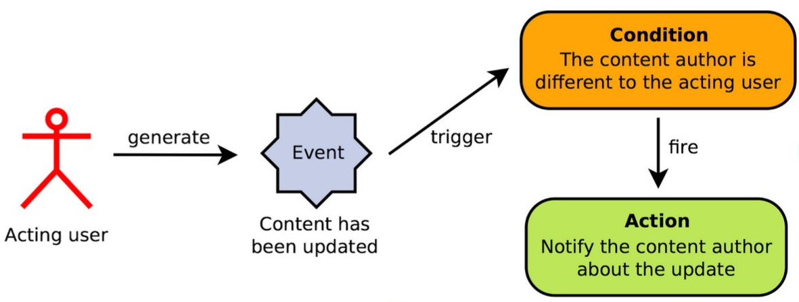

# Rules Documentation

Note: This documentation can be read online at [docs.d8rules.org](http://docs.d8rules.org/).

## Introduction

The [Rules module](http://drupal.org/project/rules) allows site administrators to build flexible workflows using events, conditions, and actions (known as reactive or [ECA rules](http://http://en.wikipedia.org/wiki/Event_condition_action)).

Rules can react to events occurring on your site, such as a user logging in or a node being submitted, and it can perform customized follow-up actions such as redirecting to a certain page or setting field values.

Rules is also a framework used by other modules, allowing them to expose user-configurable components with sets of actions and conditions that are managed in easy to import/export configuration files. Rules leverages Entity API to read and act on data and work seamlessly with all types of variables and entities.

## How to contribute to the documentation

If you have trouble understanding any part of the documentation, please notify those of us who work on this section by creating an issue on our [Rules documentation repository](https://github.com/fago/rules-docs) and clearly explain what you don't understand and why - we're happy to hear from you, your contribution helps everyone at Drupal!

You can also contribute directly on our [Rules documentation repository](https://github.com/fago/rules-docs) by editing the files through the [GitHub](https://github.com/) interface directly in your browser. Alternatively, you can clone the repository and edit the book in your favorite text editor or in the official [GitBook desktop app](https://github.com/GitbookIO/editor).
